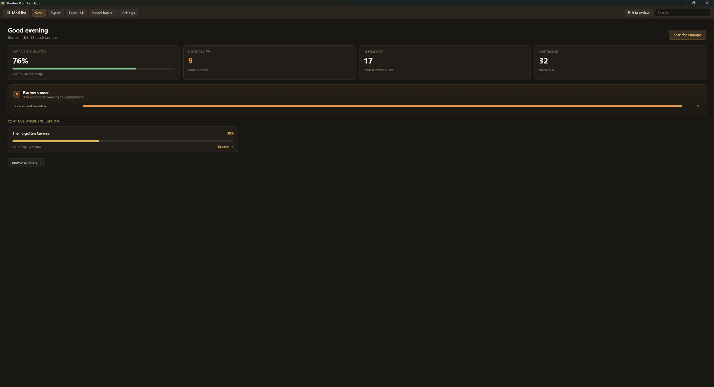
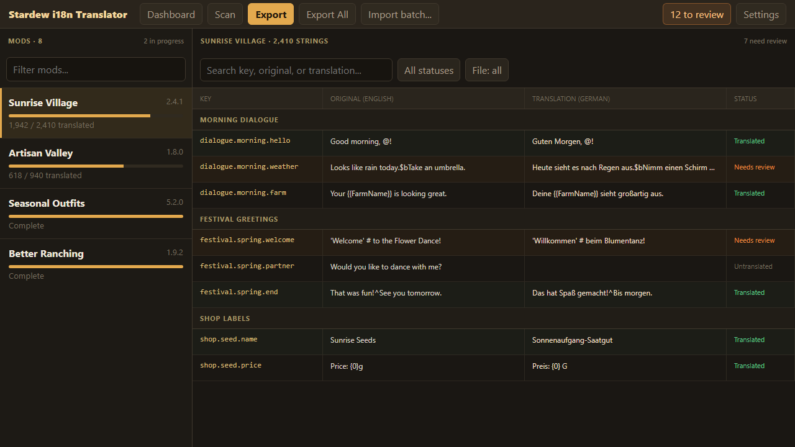
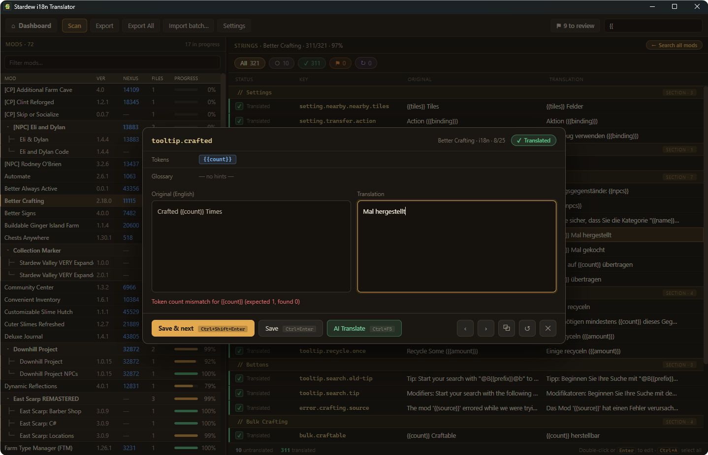

# Stardew i18n Translator

A portable Windows app for translating Stardew Valley mod `i18n` files without
digging through thousands of JSON lines.

Point it at your Mods folder, choose a language, and start translating. The app
imports existing work, tracks progress, checks Stardew-specific tokens, and
exports clean translation files with backups.



## What It Does

- Scans SMAPI mods and collects their `i18n` files.
- Groups multi-part mods and imports existing translations.
- Provides search, filters, progress tracking, bulk actions, and review queues.
- Warns about broken Content Patcher, dialogue, mail, and placeholder tokens.
- Supports manual translation, optional local AI, and external LLM batches.
- Keeps settings and translation work locally in the portable app folder.



## Getting Started

1. Download the latest portable ZIP from
   [GitHub Releases](https://github.com/Nana1873/stardew-i18n-translator/releases).
2. Extract it to a writable folder.
3. Run `stardew-i18n-translator.exe`.
4. Select your Stardew Valley folder, Mods folder, and target language.

The app creates a `Data/` folder beside the executable. Keep that folder when
updating or moving the app so your settings and translation progress come with
you.

Windows may show a SmartScreen warning because the executable is not signed.

The app requires
[Microsoft Edge WebView2 Runtime](https://developer.microsoft.com/en-us/microsoft-edge/webview2/).
It is included with Windows 11 and most Windows 10 installations. If the app
does not open, install WebView2 from Microsoft and try again.

## Translating

Open a mod, search or filter its strings, and edit them in the string editor.
You can translate manually, connect to a local model through Ollama or LM
Studio, or export a batch for a file-capable LLM.

AI suggestions always go into the review queue first. They are never treated as
finished translations automatically.

When you export, untranslated entries are left out so SMAPI can fall back to
the original English text. Token mismatches are caught before anything is
written.

For sharing a translation, **Build translation ZIP** creates a clean,
installable archive for the selected mod package. It preserves multi-component
folder paths and includes only the generated target-language `i18n` files, not
the original mod's manifests, assets, DLLs, or backups.

**Release notes** turns the same current package data into short copy-ready
publication text. It defaults to the translation language, can switch to
English, and includes coverage, included components, installation guidance,
review warnings, and careful compatibility wording. The preview stays local
and is copied to the clipboard only when you choose.



## Optional Glossary

The glossary can show official Stardew Valley terms while you translate. To
build one, unpack your own game content with
[StardewXnbHack](https://github.com/Pathoschild/StardewXnbHack), then choose
**Settings > Glossary > Build glossary**.

The glossary is optional and stays in `Data/glossary.json`.

## Privacy

The app has no accounts, analytics, telemetry, cloud API keys, or Nexus API
access. Scanning, editing, validation, glossary generation, and export all
happen locally.

Local AI requests go only to the endpoint you configure. External LLM batches
leave your computer only when you upload them yourself. Diagnostic logs stay in
`Data/logs/` and can be disabled in **Settings > About**.

## Issues And Ideas

Found a problem? Open a
[bug report](https://github.com/Nana1873/stardew-i18n-translator/issues/new?template=bug_report.yml).
Have an idea? Send a
[feature request](https://github.com/Nana1873/stardew-i18n-translator/issues/new?template=feature_request.yml).

Planned work lives in the
[issue tracker](https://github.com/Nana1873/stardew-i18n-translator/issues).
Release history is in the [changelog](CHANGELOG.md).

## Development

The app is built with Tauri 2, Rust, React, TypeScript, and Vite.

```powershell
corepack pnpm install
corepack pnpm test
corepack pnpm tauri dev
```

The detailed product specification and project boundaries live in
[SPEC.md](SPEC.md) and [SCOPE_GUARDRAILS.md](SCOPE_GUARDRAILS.md).

This project was developed with help from AI coding agents. The maintainer
reviews the code and is responsible for what ships.

## License

Copyright (C) 2026 Nana.

Source code is available here and licensed under the
[GNU General Public License v3.0 or later](LICENSE).

Stardew Valley is a trademark of ConcernedApe. This community project is not
affiliated with or endorsed by ConcernedApe.
