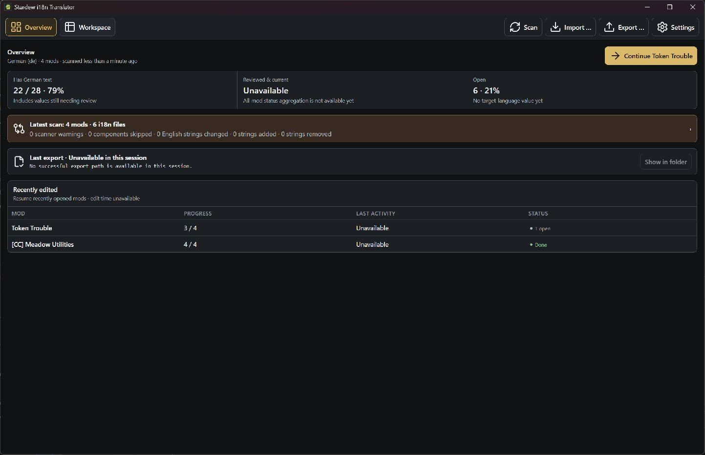
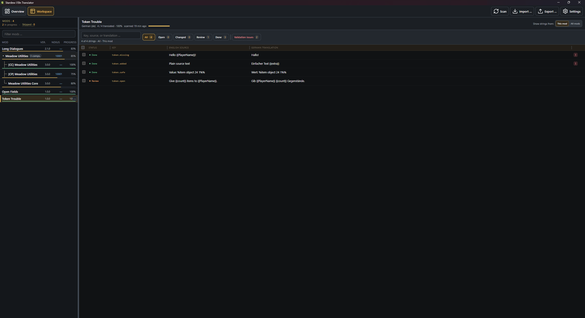
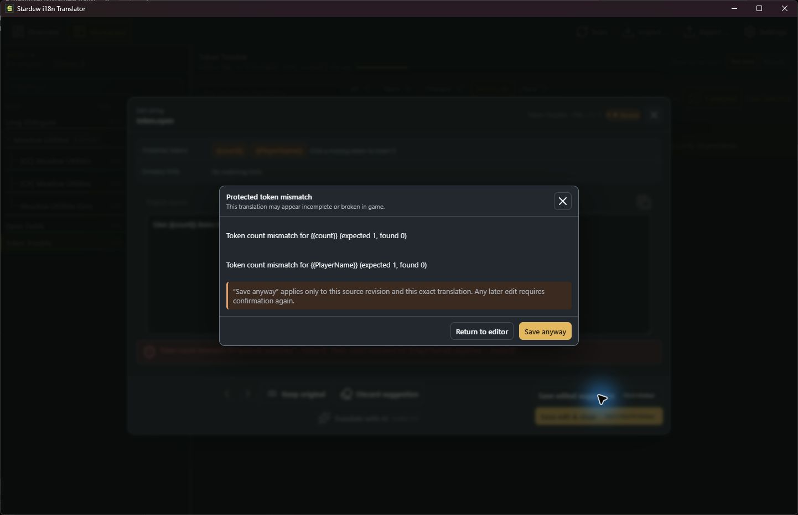

# Stardew i18n Translator

A portable Windows x64 app for translating Stardew Valley SMAPI `i18n` files in
a searchable editor instead of editing large JSON files by hand.

[Download the latest release](https://github.com/Nana1873/stardew-i18n-translator/releases/latest) ·
[Report a bug](https://github.com/Nana1873/stardew-i18n-translator/issues/new?template=bug_report.yml) ·
[Suggest a feature](https://github.com/Nana1873/stardew-i18n-translator/issues/new?template=feature_request.yml)

> [!IMPORTANT]
> This project was built with substantial help from AI coding agents. I guide the
> project direction, review and test the results, and decide what ships.



## What It Does

- Scans a SMAPI Mods folder and finds standard `i18n` translation files.
- Shows English-source changes, additions, and removals since the previous scan.
- Groups multi-part mods and imports existing translations.
- Opens on a real-data Overview and keeps detailed translation work in a
  two-panel Workspace.
- Provides search, filters, progress tracking, multi-select, bulk actions,
  resizable columns, and review queues.
- Warns about missing or changed Stardew, dialogue, mail, Content Patcher, and
  placeholder tokens before export.
- Supports manual translation, optional local AI, Codex CLI, and external LLM
  batches.
- Supports Stardew's built-in languages and curated custom-language targets.
- Builds optional glossary hints from local Stardew strings or an installed
  community language pack.
- Exports clean translation files, installable translation ZIPs, and short
  publication notes.



## Quick Start

1. Download the latest portable ZIP from
   [GitHub Releases](https://github.com/Nana1873/stardew-i18n-translator/releases/latest).
2. Extract it to a writable folder. There is no installer.
3. Run `stardew-i18n-translator.exe`.
4. Select your Stardew Valley folder, Mods folder, and target language.

The app creates a `data/` folder beside the executable. Keep this folder when
updating or moving the app so your settings and translation work come with you.

Custom-language targets can be translated and exported, but Stardew can only use
them in-game when a matching custom-language mod is installed.

Windows may show a SmartScreen warning because the executable is not signed. The
app also requires
[Microsoft Edge WebView2 Runtime](https://developer.microsoft.com/en-us/microsoft-edge/webview2/),
which is already included with Windows 11 and most Windows 10 installations.

## Supported Scope

The app is intentionally focused on the normal SMAPI translation workflow:

- Source files: `<mod>/i18n/default.json`
- Translation files: `<mod>/i18n/<language>.json`
- Existing translations, relaxed JSON used by real mods, multi-part packages,
  protected tokens, and per-language working state
- Optional read-only glossary sources from Stardew `Content/Strings/*.xnb`, an
  unpacked `Strings` folder, or compatible community language packs

It is **not** a mod manager or a general Stardew file editor. It does not
translate arbitrary `content.json`, game data files, dialogue databases, or XNB
assets, and it does not download or update mods.

## Overview and Workspace

The app opens on **Overview**. It summarizes the latest real scan, lets you
resume recently opened mods, links into useful all-mod filters, and shows the
latest successful export path from the current app session. When the backend
does not provide a value, the UI says **Unavailable** instead of inventing a
count, timestamp, change delta, or history entry.

**Workspace** places the scanned mod and component list on the left and the
virtualized string table beside it. You can work on one mod or search across all
mods, then filter by **Open**, **Changed**, **Review**, or **Done**:

- **Open:** no accepted target-language text exists.
- **Changed:** the English source changed after the translation was saved.
- **Review:** imported or AI-generated text still needs human approval.
- **Done:** the translation was explicitly saved or accepted for the current
  English source.

**Validation issues** is a separate content-check filter, not another status or
a combined review queue. It includes blocking protected-token or text
serialization errors as well as non-blocking warnings such as changed line
breaks or identical text.

The mod-list divider and the sortable **Mod**, **File**, **Status**, **Key**,
**English Source**, and **Target Translation** columns can be resized. Search,
scope, filters, sort order, pane width, and column widths are saved with the
portable workspace settings.

## Translation Workflows

You can translate in four ways:

- **Manual:** edit strings directly in the string editor.
- **Local AI:** connect to a local OpenAI-compatible endpoint such as Ollama or
  LM Studio.
- **Codex CLI:** use an installed Codex CLI through its own existing login. The
  app never reads Codex authentication files or tokens. Settings lists the
  models reported by the installed CLI and stores only the selected model id;
  if that list is unavailable, translation remains available with the CLI's
  own default model.
- **External LLM batch:** export a self-contained JSON batch, translate it with a
  file-capable LLM, and import the result. Format 2 uses one compact source
  snapshot to ensure the result still belongs to the selected mod, language,
  files, keys, and current English text before anything is saved.

Settings automatically prefers an available engine. Local AI models come from
the configured local service and its Base URL can be reset to the selected
provider's default. Codex CLI uses its own default model; the app only configures
the reasoning effort for its translation runs.

Use row checkboxes, Ctrl+click, Shift+click, or Ctrl+A to select the current
filtered result. Batch actions can copy text, mark strings as Done, keep the
English source, clear translations, start AI translation, or export an external
LLM batch; the same actions are available from the right-click menu. The default
AI engine is selected in Settings. **Translate selected with AI** immediately
includes every selected **Open** or **Changed** string and sends no Done or
Review text. An external batch may contain many selected Open or Changed strings
but is bound to exactly one mod.

Each live AI run uses the currently selected target language; built-in and
curated custom-language targets follow the same workflow. To preserve local
context, the request includes up to two preceding and two following English
source strings from the same component, relative i18n file, and section. These
neighbors are read-only context: only exact selected Open or Changed IDs may be
returned and saved.

External batch import uses a native file picker or drag and drop. Before the
Import button is enabled, a read-only preflight checks the mod, target language,
source snapshot, files, keys, protected tokens, empty results, and existing
local translations. A batch for another currently scanned mod can switch the
Workspace to that mod for a fresh preflight. Valid values enter Review, while
non-empty local translations remain untouched.

Manual translation and local-only workflows remain offline. Live AI requests
send the selected English source text, its section context, matching glossary
terms, and the bounded neighboring context described above to the selected
backend.

Large Codex CLI selections are divided into adaptive batches of at most 100
selected strings and 96 KiB of serialized input; one live run accepts up to
4,096 strings or 8 MiB of selected source text. Recovery is limited to the
affected batch: a transient failure is retried once, and a persistently invalid
response is split until a failing string is isolated so unrelated work can
continue. A protected-token mismatch gets one targeted repair attempt and stays
a blocking Review issue if it still differs. An individually oversized repair
input is kept for Review without another provider call.

The compact progress dialog shows persisted progress such as `320 / 1000` and
keeps its Cancel action. AI suggestions always enter the review queue and each
completed suggestion is saved immediately. Cancelling or restarting a longer
run therefore keeps completed Review work and naturally leaves only the
remaining Open or Changed strings to process; there is no separate persistent
AI job queue or checkpoint history. Suggestions are never treated as finished
translations automatically.
**Open review queue** returns to the affected component when it is known and to
**All mods** for a multi-component run, so cross-mod results are not hidden.

When exporting, untranslated entries are omitted so SMAPI can fall back to the
English source. Blocking token mismatches are caught before files are written;
an intentional per-string mismatch can be explicitly accepted with **Save
anyway** during review.



## Exporting and Sharing

The **Export...** menu can export the current mod, export all scanned mods,
build a translation ZIP, or prepare translation notes. Direct exports validate
the complete selected scope before the first write, create visible backups for
existing target files, and roll back an incomplete multi-file write.

**Export … > Build translation ZIP** creates an installable translation archive
for the selected mod package. It preserves multi-component folder paths and
includes only generated target-language `i18n` files, not the original mod's
DLLs, assets, manifests, or backups.

**Translation notes** creates short copy-ready publication text using the current
package, language, coverage, installation guidance, and review state.

The result tray shows real output paths and file names returned by export,
import, external LLM batch, and ZIP operations. It can be collapsed or closed;
**Latest result** opens it again, and **Copy details** copies the available
summary, paths, warnings, and workflow information.

The five latest completed backend operations, including exports, imports, LLM
batches, AI runs, release ZIPs, and batch edits, remain available in the result
tray for the current app session. One reversible batch edit can be undone until
a newer completed operation replaces its undo snapshot. Undo also refuses to
overwrite a touched string that was edited afterward, even if it was later
changed back to the batch value.

## Local Data and Privacy

The desktop app has no accounts, analytics, telemetry, or Nexus API access.
Scanning, editing, validation, glossary generation, and export happen locally.

Local AI requests go only to the local endpoint you configure. External LLM
batches leave your computer only when you upload them yourself.

Codex CLI authentication remains entirely owned by the CLI; the app does not
read or copy its authentication files or tokens. The app does not offer a
provider marketplace or a custom cloud base URL.

Live AI may send up to two preceding and two following unselected English source
strings from the same component, i18n file, section, and related key group as
read-only context. Context-only strings cannot be returned as translations or
saved by the run.

Portable data is stored under:

- `data/settings.json`
- `data/scan-source-snapshot.json`
- `data/language-state/<language>/`
- `data/glossary/`
- `data/logs/`

Diagnostic logging can be disabled in **Settings > About**.

## Help and Feedback

Use the short forms for a
[bug report](https://github.com/Nana1873/stardew-i18n-translator/issues/new?template=bug_report.yml)
or a
[feature request](https://github.com/Nana1873/stardew-i18n-translator/issues/new?template=feature_request.yml).
A rough report is fine.

For bugs, the app version, the affected mod, the on-screen error, and a few
reproduction steps are usually enough. Logs can be opened from the About page in
Settings. They may contain local paths, so remove private information before
attaching them.

Release history is in the [changelog](CHANGELOG.md).

## Development

The app uses Tauri 2, Rust, React, TypeScript, and Vite.

```powershell
corepack pnpm install
corepack pnpm test
corepack pnpm tauri dev
```

Keep changes focused and verify the area you changed. Repository guidance is in
[AGENTS.md](AGENTS.md), the current product contract is in [SPEC.md](SPEC.md), and
release instructions are in
[docs/release/release-process.md](docs/release/release-process.md).

## License

Copyright (C) 2026 Nana.

Licensed under the [GNU General Public License v3.0 or later](LICENSE).
