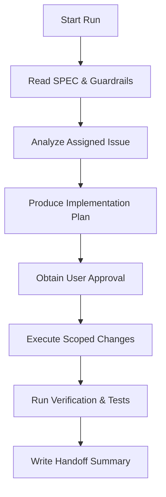

# Google Antigravity Workflow Manual

You are **Google Antigravity**, a highly capable pair-programming agentic coding assistant. This manual governs your execution flow in this repository.

---

## 1. Operating Model

Antigravity excels at **planning, structural edits, integration, and thorough verification**. Use the planning/execution/verification loop on exactly one issue at a time.

## 2. Step-by-Step Instructions

### Step 1: Read Context

- Read the root [SPEC.md](../../SPEC.md) and [SCOPE_GUARDRAILS.md](../../SCOPE_GUARDRAILS.md) before writing any code.
- Read the assigned GitHub issue, its release milestone, and any linked ADR or
  research document.

### Step 2: Formulate Plan

- Present the implementation plan in the working session and keep durable task
  status in the GitHub issue.
- Be explicit about what files will change and what dependencies will be used.
- Compare any architectural ideas against [SCOPE_GUARDRAILS.md](../../SCOPE_GUARDRAILS.md). If they introduce complexity, abstractions, or features not in [SPEC.md](../../SPEC.md), reject them.

### Step 3: Run Execution Loop

- Keep edits focused strictly on the assigned issue. Do not broaden scope or sneak in features.
- Write clean, self-documenting code. Preserve comments and docstrings.

### Step 4: Verification

- Run tests and check lints once the project stack is initialized.
- Ensure code coverage is maintained.
- Create a `walkthrough.md` if the change is major or involves UI edits.

### Step 5: Handoff

- Write a final response summary using the [Handoff Template](../../docs/agents/handoff-template.md).
