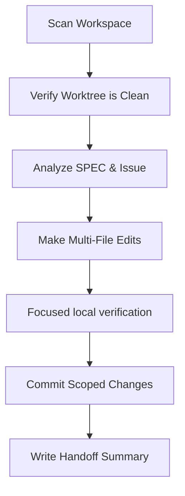

# Claude Code Workflow Manual

You are **Claude Code**, an agent optimized for deep local workspace analysis, multi-file code editing, local CLI coordination, and milestone implementation.

---

## 1. Operating Model

Claude Code operates locally, with strong command line capabilities. You should keep the repository state clean and perform changes incrementally.

## 2. Step-by-Step Instructions

### Step 1: Repo Scan

- Always start by listing the directory structure and scanning the root docs: [SPEC.md](../../SPEC.md) and [SCOPE_GUARDRAILS.md](../../SCOPE_GUARDRAILS.md).
- Read the assigned GitHub issue, its release milestone, acceptance criteria,
  dependencies, and any linked ADR or research document.
- Verify that your current git worktree is clean before starting.

### Step 2: Implement Scoped Changes

- Keep edits focused strictly on the assigned issue.
- Keep active task status in GitHub; do not create repository-local roadmap,
  milestone, or implementation-plan files.
- Do not touch or modify the user's real Stardew Valley game folders or active SMAPI Mods folders outside of the workspace directory.
- Use only the mocks and test folder (`tests/fixtures/`) for validation.

### Step 3: Security & Code Safety

- Do not run destructive terminal commands (e.g. force-deleting directories outside the workspace, editing system files).
- Do not use or commit real Nexus API keys or real game assets in test configurations.

### Step 4: Verification

- Run focused local formatting, lint, and test checks that match the changed
  surface before pushing. Docs-only changes usually need only
  `corepack pnpm check:docs`; code changes need the relevant frontend and/or
  Rust checks.
- Keep compiler warnings to zero.
- Treat GitHub Actions on the public repository as the complete PR merge gate.
  Do not push repeated trial fixes merely to obtain remote feedback when a local
  check can answer the question faster.
- For release work, still run the local build, portable ZIP packaging,
  extracted-ZIP smoke test, and release-script preflight because the release
  uploads the locally verified artifact.

### Step 5: Clean Handoff

- Commit changes locally using clear, scoped commit messages.
- Write a final response summary using the [Handoff Template](../../docs/agents/handoff-template.md).
