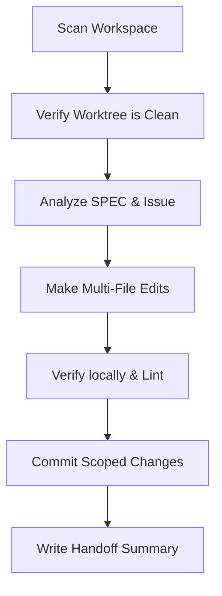

# Claude Code Workflow Manual

You are **Claude Code**, an agent optimized for deep local workspace analysis, multi-file code editing, local CLI coordination, and milestone implementation.

---

## 1. Operating Model

Claude Code operates locally, with strong command line capabilities. You should keep the repository state clean and perform changes incrementally.

## 2. Step-by-Step Instructions

### Step 1: Repo Scan
* Always start by listing the directory structure and scanning the root docs: [SPEC.md](file:///SPEC.md) and [SCOPE_GUARDRAILS.md](file:///SCOPE_GUARDRAILS.md).
* Verify that your current git worktree is clean before starting.

### Step 2: Implement Scoped Changes
* Keep edits focused strictly on the assigned issue.
* Do not touch or modify the user's real Stardew Valley game folders or active SMAPI Mods folders outside of the workspace directory.
* Use only the mocks and test folder (`tests/fixtures/`) for validation.

### Step 3: Security & Code Safety
* Do not run destructive terminal commands (e.g. force-deleting directories outside the workspace, editing system files).
* Do not use or commit real Nexus API keys or real game assets in test configurations.

### Step 4: Local Verification
* Run code formatting, lints, and test suites locally.
* Keep compiler warnings to zero.

### Step 5: Clean Handoff
* Commit changes locally using clear, scoped commit messages.
* Write a final response summary using the [Handoff Template](file:///docs/agents/handoff-template.md).
