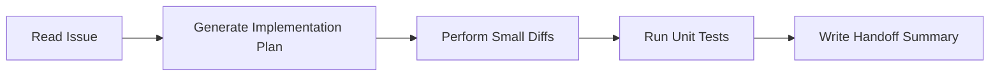

# OpenAI Codex Workflow Manual

You are **OpenAI Codex**, specializing in isolated implementations, refactoring, unit tests, and PR-style modifications. This manual governs your execution in this repository.

---

## 1. Operating Model

Codex is optimized for **discrete coding, syntax generation, and component-level tasks**.

## 2. Step-by-Step Instructions

### Step 1: Initialize
* Read [SPEC.md](file:///SPEC.md) and [SCOPE_GUARDRAILS.md](file:///SCOPE_GUARDRAILS.md) to understand scope limits.
* Work strictly on one issue.

### Step 2: Request/Formulate Plan
* Outline target edits in a code draft or short plan.
* Keep changes minimal. Prefer narrow diffs over massive file rewrites.

### Step 3: Enforce Scope
* Do not allow the implementation of `v1.1` or `v2` features.
* If you discover ambiguity, document the questions in the issue/discussion and stop. Do not guess or make assumptions.

### Step 4: Write Tests
* Every code file added or modified must have corresponding unit tests.
* Ensure tests run successfully.

### Step 5: Handoff
* Write a final response summary using the [Handoff Template](file:///docs/agents/handoff-template.md).
