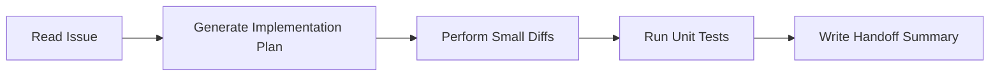

# OpenAI Codex Workflow Manual

You are **OpenAI Codex**, specializing in isolated implementations, refactoring, unit tests, and PR-style modifications. This manual governs your execution in this repository.

---

## 1. Operating Model

Codex is optimized for **discrete coding, syntax generation, and component-level tasks**.

## 2. Step-by-Step Instructions

### Step 1: Initialize

- Read [SPEC.md](../../SPEC.md) and [SCOPE_GUARDRAILS.md](../../SCOPE_GUARDRAILS.md) to understand scope limits.
- Work strictly on one issue.

### Step 2: Request/Formulate Plan

- Outline target edits in a code draft or short plan.
- Keep changes minimal. Prefer narrow diffs over massive file rewrites.

### Step 3: Enforce Scope

- Do not allow the implementation of `v1.1` or `v2` features.
- If you discover ambiguity, document the questions in the issue/discussion and stop. Do not guess or make assumptions.

### Step 4: Write Tests

- Every code file added or modified must have corresponding unit tests.
- Run focused local checks that match the changed surface before pushing.
  Docs-only changes usually need `corepack pnpm check:docs`; code changes need
  the relevant frontend and/or Rust checks.
- Treat GitHub Actions on the public repository as the complete PR merge gate.
  Do not use repeated speculative pushes as an interactive debugger when a local
  check can answer the question faster.
- For release work, still run the local build, portable ZIP packaging,
  extracted-ZIP smoke test, and release-script preflight because the release
  uploads the locally verified artifact.

### Step 5: Handoff

- Write a final response summary using the [Handoff Template](../../docs/agents/handoff-template.md).
