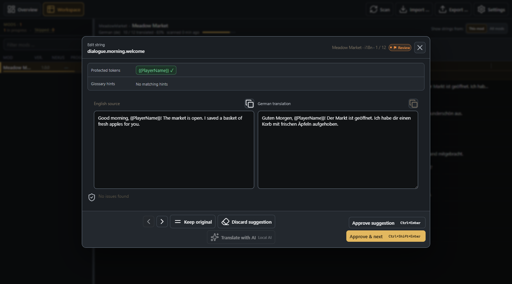

# User guide

[Download and first launch](../README.md#get-started) · [AI guide](ai.md) ·
[Troubleshooting](troubleshooting.md)

## Scan and choose a mod

Choose the game folder, Mods folder, and target language during setup. You can
change them later in **Settings**. Translation work is stored separately for
each language. Custom-language targets also need a matching language mod for
in-game use; selecting a language here does not install one.

The scan reads standard `i18n/default.json` sources and existing target-language
files. Multi-part packages are grouped in the mod list. Mods that do not use
standard SMAPI i18n files cannot be translated here.

**Overview** shows scan totals and recently opened mods. Open **Workspace** and
select a mod or component to work on its strings. Use **Scan** after installing
or updating mods. After two complete scans, the app can report English strings
that were added, changed, or removed. A scan with an attention-requiring skipped
component keeps the last complete baseline; comparison counts are unavailable
until a complete scan succeeds. Expected community-language-pack exclusions
do not make a scan incomplete.

## Edit and save

Double-click a string, or select it and press Enter. The English source stays
read-only; enter your translation on the other side. Section headings, protected
tokens, and matching glossary terms help retain the meaning and formatting.

- **Save** accepts the current translation and closes the editor.
- **Save & next** accepts it and opens the next string.
- **Keep original** copies the English source as an intentional translation.
- **Clear** empties the field; save it to return the string to Open.

For Review entries, the save actions are called **Approve suggestion** and
**Approve & next**. Changed entries use **Keep translation** or **Save update**
depending on whether you edited the text.

Saving stores work in the app's portable `data/` folder. It does not change the
mod's translation files until you export.

The example uses synthetic text. Preserve placeholders such as `{{PlayerName}}`
and dialogue commands when translating the surrounding words.

## Understand status and validation

| Workspace filter | Meaning                                                                                                                                |
| ---------------- | -------------------------------------------------------------------------------------------------------------------------------------- |
| **Open**         | No nonempty translation is available.                                                                                                  |
| **Changed**      | The English source changed since the saved translation.                                                                                |
| **Review**       | A live AI suggestion or external LLM result has not been accepted.                                                                     |
| **Done**         | A translation was saved/accepted for this source, or a nonempty existing translation file was loaded without an overriding saved edit. |

Existing `<language>.json` files are taken as translated when scanned; this is
different from importing an external LLM batch, which creates Review entries.
Done does not guarantee that the wording is correct or that validation passes.

**Validation issues** is an independent filter. Missing or changed protected
tokens and invalid text can block export. Suspicious literal escape changes
can produce warnings without blocking. Open an affected string to inspect the
source and target. If a token difference is intentional, **Save anyway** accepts
that exact source/target mismatch; editing it again can require a new decision.

## Search, select, and work in batches

Use **This mod** or **All mods** to set your search scope. Search matches keys,
English source text, and translations. Combine it with status and validation
filters to find the work you need. Sorting, filters, pane width, and resizable
column widths are remembered across sessions.

Select rows with checkboxes, Ctrl+click, Shift+click, or Ctrl+A in the string
table. The batch toolbar and right-click menu offer copy, mark Done, keep
original, clear translation, and AI/batch actions. Mark Done only after checking
the selected translations. Empty rows cannot be marked Done.

One completed batch edit can be undone while its snapshot is still current.
A newer completed operation replaces that snapshot. Undo refuses to overwrite
strings edited since the batch, even if they were changed back afterward.
History and undo are available only for the current app session.

Useful defaults are Ctrl+F for search, Ctrl+Enter for Save, Ctrl+Shift+Enter for
Save & next, and Alt+Left/Right for editor navigation. Navigation saves dirty
edits when possible; resolve any validation confirmation before continuing.
See **Settings > Shortcuts** for all bindings and customization.

## Build a glossary

Open **Settings > Glossary** and choose **Build glossary** when sources are
available, or **Rebuild glossary** when the cache needs refreshing.

Built-in languages use local Stardew `Content/Strings` XNB files, with unpacked
Strings JSON as a fallback. Supported community language packs can supply local
Strings dictionaries for custom targets. Missing sources simply leave the
glossary unavailable; editing and export still work.

The glossary supplies hints for recognized names and terms. It does not
translate game assets, replace your chosen language pack, or guarantee that an
AI model will use the right wording. Matching terms also accompany AI requests;
see [data sent to AI](ai.md#data-and-privacy).

## Export translation files

Choose **Export…** for the current mod or all scanned mods. The confirmation
shows the scope, replacement information, and strings needing attention.

**Nonempty Review and Changed translations are included in export after a
warning.** They do not become Done as a result. Empty entries are omitted so
SMAPI can fall back to English. Unresolved blocking validation issues must be
fixed or an intentional token mismatch explicitly accepted before export.

Export writes `i18n/<language>.json` files inside the selected mods. Existing
targets receive a `.bak` backup, for example `de.json.bak`. Export replaces these
targets rather than appending to them: target-only keys without an English
source are omitted. A file with no nonempty translations is removed after
backup. Ordinary failures partway through a multi-file export roll back the
affected targets and backups. See [backup recovery](troubleshooting.md#recovering-a-backup)
if you need to restore an earlier file.

Portuguese export uses `pt.json`; an existing `pt-BR.json` is accepted on import
and backed up when normalized during export.

## Share a translation

Select a mod package and use **Export… > Build translation ZIP**. Check its
preview and choose a destination. The ZIP preserves component folder paths and
contains only generated target-language i18n files. Recipients still need the
original mod; the ZIP does not include its assets, DLLs, or manifest.

Use **Translation notes** for copy-ready package, language, coverage, review,
and installation information. Check that text before publishing it alongside
the ZIP. Uploading and publication happen outside the desktop app.

## Find operation results

The result tray shows output paths, file names, summaries, and warnings.
**Latest result** reopens the most recent operation and **Copy details** copies
its available information. The five latest completed operations remain
accessible for the current session. This history is separate from saved
translations, which remain in `data/` after closing the app.
